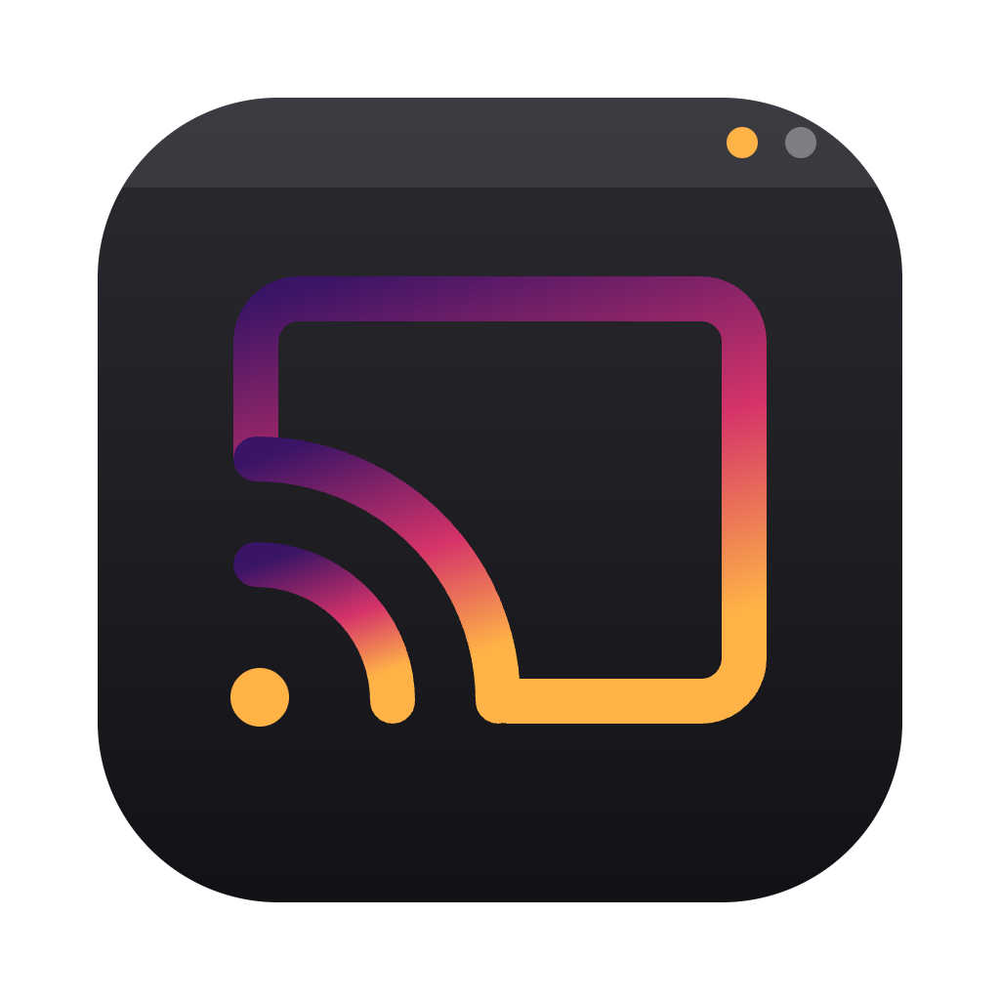
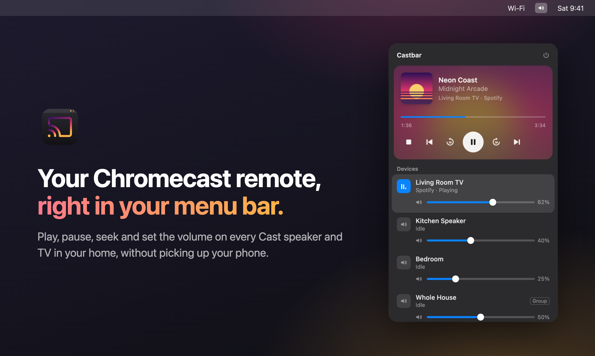
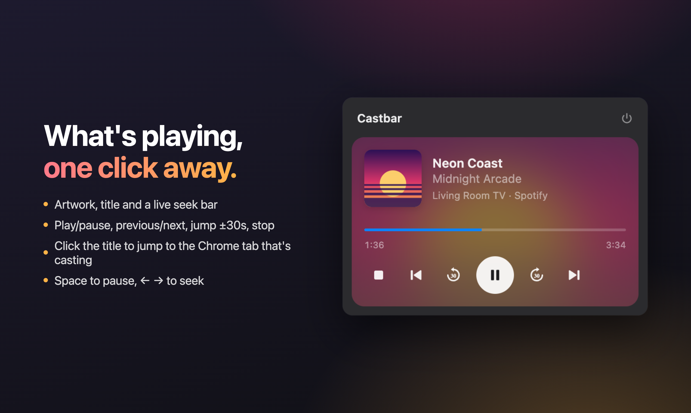
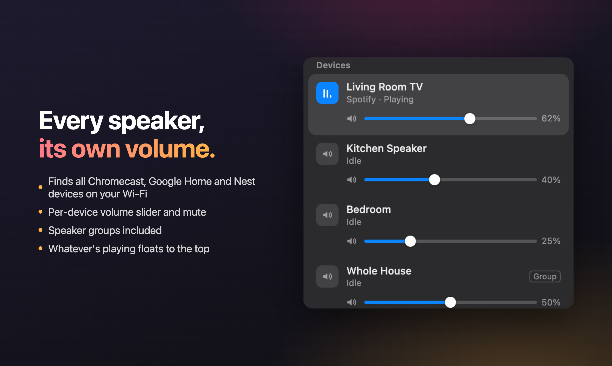

# Castbar

**Your Chromecast remote, right in your Mac menu bar.** Control every Chromecast, Google Home and Nest speaker or TV: see what's playing, pause, skip, seek and set each speaker's volume without picking up your phone.

🚀 Launching on [Product Hunt](https://www.producthunt.com/products/castbar) on 27 September 2026. Come say hi!



- Now playing: artwork, title, seek bar, play/pause, ±30s, previous/next, stop
- Every device on your Wi-Fi with its own volume slider and mute
- The card follows whatever is playing; the playing device sits on top
- Click the title to jump to the Chrome tab that's casting
- Light and dark mode, Space to play/pause, ←/→ to seek 10s

 

## Install

```sh
brew tap itssarthak/castbar
brew trust itssarthak/castbar
brew install castbar && open -a Castbar
```

Or download `Castbar-*.zip` from [Releases](https://github.com/itssarthak/castbar/releases), unzip, and move
`Castbar.app` to Applications. The app isn't signed yet, so the first time right-click it and choose **Open**.

Requires an Apple Silicon Mac on macOS 11 or later.

## Run from source

```sh
python3 -m venv .venv && .venv/bin/pip install -r requirements.txt
.venv/bin/python castbar/app.py
```

Build the app: `.venv/bin/pip install py2app && .venv/bin/python setup.py py2app` → `dist/Castbar.app`

## Release

```sh
scripts/release.sh 0.2.0   # builds, zips, publishes the GitHub release, updates the Homebrew cask
scripts/downloads.sh       # download counts per release (Homebrew installs included)
```

Inspired by [Casita](https://github.com/david-kuehn/casita).
